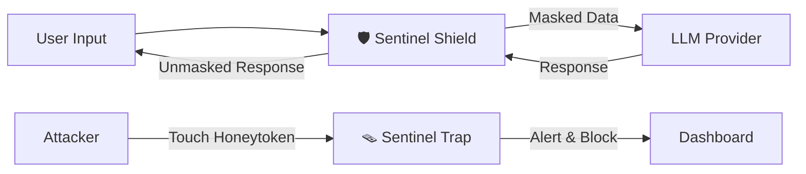

# 🛡️ Sentinel: AI Trust Infrastructure

> "Imagine giving your house keys to a stranger just because they seem smart. That is what we do with AI today."

[](https://opensource.org/licenses/MIT)
[](https://www.python.org/)
[]()

## 📑 Executive Vision
Sentinel is a **defense-in-depth security layer** designed specifically for the Agentic AI era. It acts as a middleware between your application and Large Language Models (LLMs), ensuring that:
1.  **PII never leaves your perimeter:** Sensitive data is masked locally before API transmission.
2.  **Attackers are actively neutralized:** Honeytoken injection traps malicious actors attempting to prompt-inject your agents.

## 🏗️ System Architecture (The First Principles)

The system operates on a strictly modular architecture to ensure zero latency impact.



## 📂 Project Structure
```bash
sentinel-core/
├── src/
│   ├── shield/       # PII Masking & Cryptographic Logic
│   ├── trap/         # Active Defense & Honeytoken Generation
│   └── utils/        # Shared Engineering Utilities
├── tests/            # Unit & Integration Tests (TDD)
├── docs/             # Architecture Blueprints
└── main.py           # Entry Point
```

## 🚀 Roadmap
- [ ] Phase 1: The Shield - Implement local AES-256 masking for Emails, Credit Cards, and API Keys.
- [ ] Phase 2: The Trap - Develop dynamic honeytoken injection logic.
- [ ] Phase 3: The Core - Release PyPI package `pip install sentinel-core`.

Architected with First Principles by [Mohamed Abdelaziz]